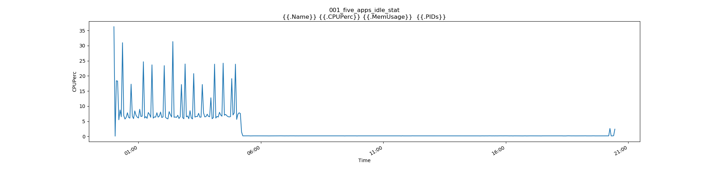
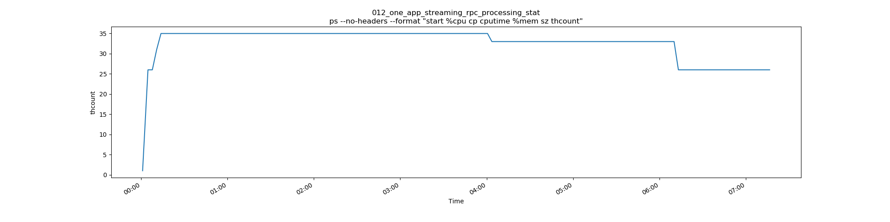

# SDL resources consumption

## Environment

### Hardware

Measured on Raspberry PI 4

- 1.5 GHz quad-core Arm® Cortex®-A72 CPU
- 4 GB LPDDR4 memory
- 16 GB micro SD

### Software

- Raspberian lite
- Docker image

### SDL environment

Used latest stable SDL version [6.0.1](https://github.com/smartdevicelink/sdl_core/releases/tag/6.0.1)

SDL build without logs :

```sh
cmake -DENABLE_LOGS=OFF $SDL_SOURCES
```

Steraming tested with output as a file in ini file :

```ini
VideoStreamConsumer = file
AudioStreamConsumer = file
VideoStreamFile = video_stream_file
AudioStreamFile = audio_stream_file
```

## Testing tools

Used Automated Test Framework (ATF) feature - [Remote automated testing](https://github.com/smartdevicelink/sdl_evolution/blob/master/proposals/0206-remote_atf_testing.md).

On hardware was executed:

- SmartDeviceLinkCore
- RemoteAutomatedTestingAdapter

ATF <-> RemoteAutomatedTestingAdapter connected via direct Ethernet cable.

### Measurment tools

Used 3 tools for collecting RAM, CPU, thread count statistics :

- ps
- pidstad
- docker stats

## Testing results:

Was tested several usecases :

- 001_five_apps_idle_stat
- 002_five_devices_one_app_idle_stat
- 003_five_devices_fice_apps_on_each_idle_stat
- 004_one_app_multiple_reg_act_stat
- 005_one_app_streaming_stat
- 006_ptu_through_mobile_stat
- 007_ptu_through_hmi_stat
- 008_put_file_stat
- 009_perform_interaction_stat
- 010_perform_audio_pass_thru_stat
- 011_five_apps_multiple_reg_act_stat
- 012_one_app_streaming_rpc_processing_stat

Test scripts for testing are available :
Measurment results are available :

### Resource Overview

### IDLE

In IDLE state SDL takes ~40 (+/- 5) MB.


CPU consumption is close to 0 %




In IDLE state is 25 - 35 threads in SDL.


### RPC communication

With active RPC communiation or registering applicaiton SDL do not exceed 45 MB.


It takes up to 50% (half of the 1 core).


Thread count id close to 30


### Streaming

SDL takes up to 100 MB during streaming.


SDL consumes close to 80-100% CPU ( one full core) for streaming processing.


RPC communication during streaming do not add significant resource spendings.

Thread count during streaming is still close to 30 - 35. 




### PTU

Policy table update takes abount 40 - 45 MB for processing.


PTU takes up tp 25% CPU (quoter of 1 core)


Thread count during PTU is still 30 - 35


## Issues in SDL

There is several problems currently exist in SDL:

### Unable to use SDL with logs in Raspberry PI

If SDL build with logs, Raspberry PI is not able to run it and establish communication.

### Memory leaks

#### Log4cxx thread leak

Memory leak on SDL build with logger in scenarious:

_Note_ : This measures was done on x64 Ubuntu linux.
[logger Memory leak 1](../assets/proposals/sdl_resources/logger_memory_leak1.png)
[logger Memory leak 2](../assets/proposals/sdl_resources/logger_memory_leak2.png)

#### Registering 5 applicaiton multiple times memory leak

Multiple registering/unregistering applicaitons continiously add memory leak, future  investication blocked because of thread leak and core crash. 
[Memory leak ](../assets/proposals/sdl_resources/011_five_apps_multiple_reg_act_stat/docker_docker_MemUsage.png)

### Thread count leak

Following use case :

__Registering 5 applicaiton multiple times__ cause thread leak on SDL :

[Thread leak](../assets/proposals/sdl_resources/011_five_apps_multiple_reg_act_stat/pidstat_pidstat_threads.png)

## SDL stability tests

Created measurments test cases should be executed on regular base and should be extended.

Based on current measurments ew can create resource constrains, and check that SDL will not exceed then in future releaseses.

Non funcitonal requirenments should should contain more than RAM\CPU constrains :

- SDL bandwith for streaming.
- Delay introduced by SDL in RPC\streaming processing
- Control message response time.
- RPC message response time (minus HMI response time)